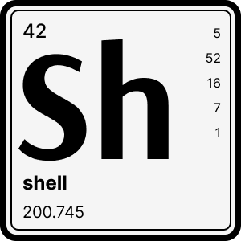

<br />
<div align="center">
  

  <h1 align="center">shell</h3>

  <p align="center">
    Thin wrapper around `child_process` for easier shell commands calls.</i>
  </p>
<p>
  
  
  <a href="https://codeclimate.com/github/tuplo/shell/test_coverage">
    
  </a>
</p>

</div>

## Why

TODO

## Usage

TODO

## Install

```bash
$ npm install @tuplo/shell

# or with yarn
$ yarn add @tuplo/shell
```

## API

TODO


## License

MIT